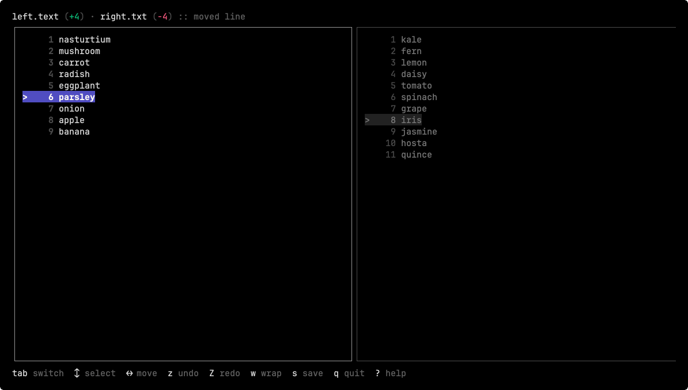

# Bucket

`bucket` is a terminal tool for reviewing two text files side by side and moving lines between them.



Install:

```bash
brew tap jpwain/bucket https://github.com/jpwain/bucket.git
brew install jpwain/bucket/bucket
```

Usage:

```bash
bucket left.txt right.txt
```

Controls:

- `tab` switch focus
- `up` / `down` move selection
- `shift+up` / `shift+down` move the unfocused cursor
- `left` / `right` move the selected line
- `shift+left` / `shift+right` move the selected line below the destination cursor
- `z` undo
- `Z` redo
- `w` toggle wrapping
- `s` save
- `q` quit
- `?` help

The app keeps edits in memory until you save. It preserves newline style and trailing newline behavior when writing files back to disk.
